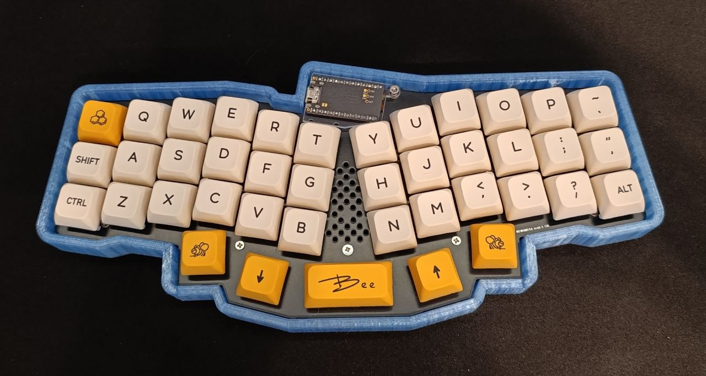
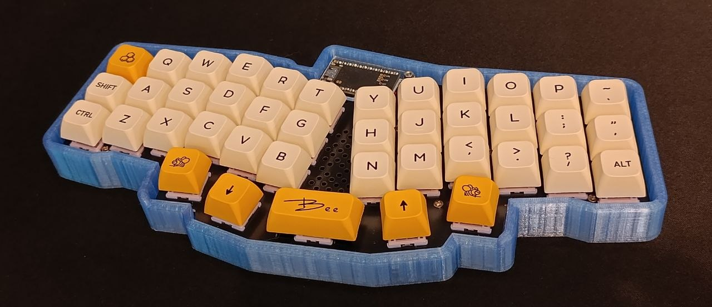

## My Reviung41
🧰 A custom 40% mechanical keyboard that I've soldered and assembled myself. A hand-crafted tool that makes programming as comfortable as never before. [Credit for the PCB and the Reviung in itself goes to gtips](https://github.com/gtips/reviung).

### What I used
* The Reviung PCB
* The nice!nano v2 Microcontroller _(+ obviously ZMK firmware)_
* Honey Milk Keycaps
* Akko Fairy Silent Switches

